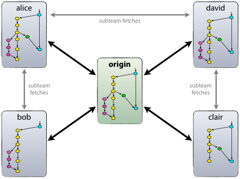

# GIT


## 介绍
git是一个分布式管理工具，区别于svn，他拥有集中的服务器同时每个客户端都是一个仓库
没有网络的时候可以在各自的仓库进行修改和提交操作，在有网的环境中push到中央服务器


## git特性
 - 分布式
 - 快照
 - 状态区
 - 分支

 #### 常用的命令
 - git init
 - git add
 - git commit
 - git commit -a
 - git push
 - git stutas
 - git log
 - git diff
 - git stash
 - git stash pop

#### git分支的操作命令
 - git checkout -b
 - git branch
 - git merge
 - git log --graph

 #### 更改提交的操作
 - git reset
 - git commit -- amend
 - git rebase -i

 #### 提交到远程仓库
 - git remote add
 - git push
 - git pull
 - git fetch


#### 从远程仓库获取
 - git clone
 - git fetch
 - git feature -D


#### git submoudle

  - git submodule update 更新submodule代码


### git存储的介绍
git存储的是文件的快照
>关于指定数据集合的一个完全可用拷贝，该拷贝包括相应数据在某个时间点（拷贝开始的时间点）的映像


每次你提交更新，或在 Git 中保存项目状态时，它主要对当时的全部文件制作一个快照并保存这个快照的索引。 为了高效，如果文件没有修改，Git 不再重新存储该文件，而是只保留一个链接指向之前存储的文件。

 - 近乎于所有的操作都在本地进行，本地的仓库中保存了所有的历史数据，并且没有网络的时候也可以在本地进行提交。
 - Git 保证完整性
 - Git 一般只添加数据

### git的三种状态
>已提交（committed）已修改（modified）已暂存（staged)


# git 使用

- 创建git仓库

  
  - git init
  - git clone
  - git add . (想要添加的文件，一般都使用。添加所有的文件)
  - git commit -m "commit message"
  - git commit -a -m "commit msg" (包含git add命令)
  - git remote add origin
- 更改git配置
  - 配置个人信息

    > git config --global user.name xyz
  - 配置大小写敏感

    > git config core.ignorecase false
  - 设置别名

    ```
    $git config --global alias.lg "log --color --graph --pretty=format:'%Cred%h%Creset-%C(yellow)%d%Creset%s%Cgreen(%cr)%C(bold blue)<%an>%Creset'
--abbrev-commit"
    ```

- git分支
  - git branch 查看分支
  - git branch -a 查看所有的分支，包括远程分支
    - git默认情况下会有一条master分支线

    
  - git checkout -b [branchName] 创建并且切换到分支相当于
    ```
    $ git branch dev
    $ git checkout dev
    ``` 
    
    - 当我们做出修改之后

    
  - git merge dev 合并名字叫做dev的分支
    - git 如果master没有修改的话会直接将指针指向dev并不会有commit动作 

    
    - git 如果master做出了修改的话，就需要手动合并冲突
    
    
  - git branch -d dev 删除分支，当有未合并的分支被删除的时候会报错


- 提交操作的修改
  - git commit -amend  （尝试重新提交）
  - git reset HEAD git.md （取消该文件的暂存）
  - git checkout -- git.md （撤销对该文件的修改）危险命令，会撤销所有的修改

- 查看当前的状态
  - git status 查看当前文件存储的状态
  - git branch 查看分支状态
  - git branch -a 查看所有的分支

- 添加ignore文件
  - 将需要忽略的文件配置到项目根目录的.ignore文件中
  - [ignore文件合集](https://github.com/github/gitignore)

- 查看仓库状态以及文件对比

  - git status
  - git diff 使用该命令对比当前文件和暂存区域快照之间的差异，修改之后还没有暂存起来的内容
  - git diff --cached （--staged）查看已经暂存的将要添加到下次提交的内容
  - git diff HEAD  (HEAD^)标识上上个版本
  - git blame [filename] 查看该文件的修改记录

- 仓库分为工作区，暂存区，历史区

    

  - git checkout --[fileName] 放弃该文件在工作区的修改
  - git reset HEAD [fileName] 将该文件会退到之前的HEAD版本
  - git stash 暂存工作区中的代码
  - git stash list
  - git stash apply 取出暂存的代码
  - git stash pop 取出暂存的代码，并删除暂存文件
  > 使用场景：当在进行代码修改的时候，突然发现需要紧急修改的bug，但是当前的代码没有修改完成，没法提交，就用git stash 暂存代码，git pull 拉取最新的代码进行修改提交之后再git stash pop继续修改之前的代码

- 版本回退 时光倒流
  - git log 查看提交的日志，
  - git log -stat 查看每次提交的简略的统计信息
  - git reset --hard 版本信息  --根据生成的sha-1对应版本进行回退
  > HEAD 表示当前的版本，HEAD^表示上一个版本，以此类推，版本迭代太多的话可以使用HEAD~100

- 撤销版本回退 回到未来
  - git reflog 查看操作的日志
  - git reset --hard 版本信息  -- 还原到该操作时间点的版本


- git 打标签
  > 唯一确定了打标签时刻的版本。将来无论什么时候，取某个标签的版本，就是把那个打标签的时刻的历史版本取出来。所以，标签也是版本库的一个快照。

  - git tag tagName  添加标签
  - git tag -d tagName  删除该标签
  - git push origin tagName 推送一个标签到远程仓库
  - git push origin --tags  推送所有的标签到远程仓库
  - git push -u origin master 推送到远程并添加upstream，trach branch


## git分支管理策略
  - 一般我们会维护几个分支

    

  - master分支上是我们上线的稳定版的项目分支
  - dev分支是我们开发过程中使用的分支
  - feature分支使我们开发未来版本功能的分支
  - 可能多人协作的时候还要维护自己的分支

 ### 简介
 > 


## git版本库

- 工作区 
  >我们看到的文件夹就是一个工作区
- 暂存区  
  >我们git add 之后就会将修改存储在暂存区
- 分支
  >我们git commit之后提交到分支

    - git diff    是工作区(work dict)和暂存区(stage)的比较
    - git diff --cached    #是暂存区(stage)和分支(master)的比较

## 参考资料

- [话说Svn与Git的区别](http://www.jianshu.com/p/bfec042349ca)

- [官方文档](https://git-scm.com/book/zh/v2)

- [廖雪峰的git教程](http://www.liaoxuefeng.com/wiki/0013739516305929606dd18361248578c67b8067c8c017b000)

- [ignore文件合集](https://github.com/github/gitignore)


 
